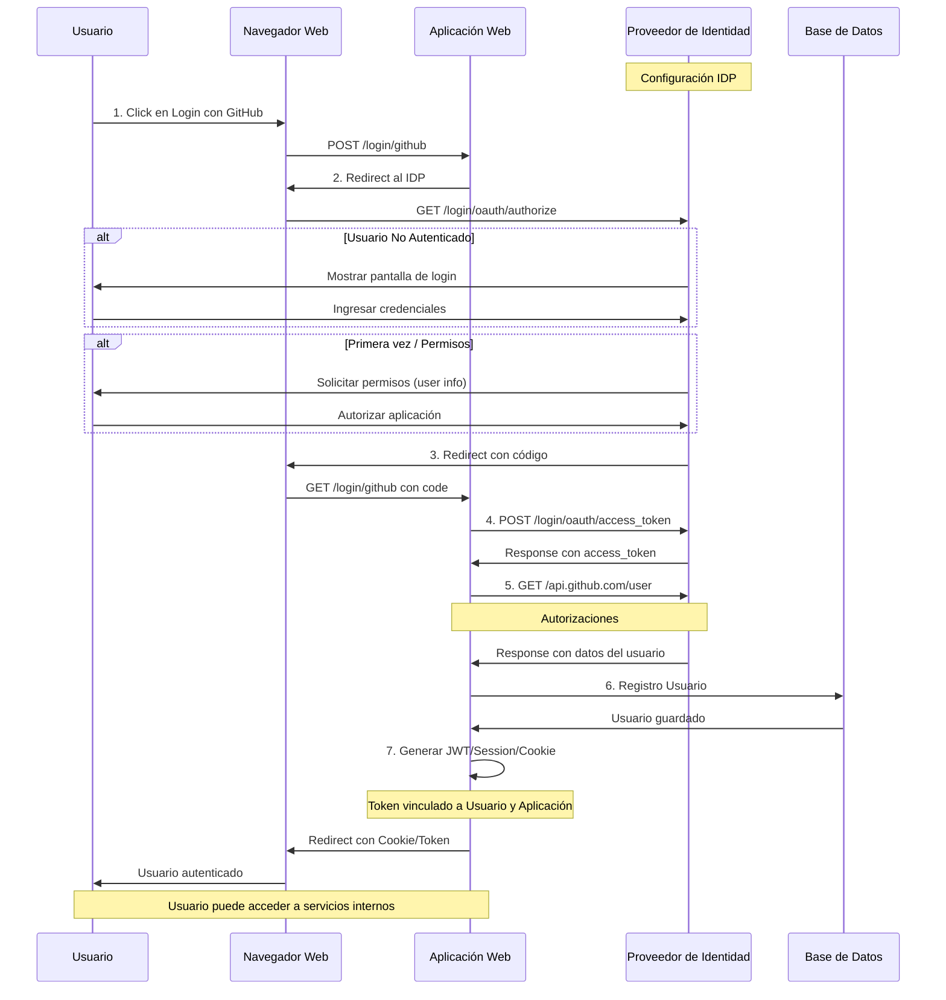

# Flujo OAuth Web - Autenticación con Proveedor de Identidad

## Diagrama de Secuencia

## Descripción del Flujo

### Paso 1: Inicio de Sesión
El usuario hace clic en el botón de login y se envía un formulario POST a la aplicación web.

### Paso 2: Redirección al Proveedor de Identidad
La aplicación redirige al usuario al proveedor de identidad (GitHub, Google, Twitter, etc.) con los parámetros necesarios: client_id, redirect_uri y scope.

### Paso 3: Callback con Código de Autorización
Después de que el usuario se autentica y autoriza la aplicación, el proveedor de identidad redirige de vuelta a la aplicación con un código de autorización temporal.

### Paso 4: Intercambio de Código por Token (Server-to-Server)
La aplicación realiza una petición POST al proveedor de identidad enviando:
- client_id
- client_secret
- code
- redirect_uri

El proveedor responde con un access_token.

### Paso 5: Obtención de Datos del Usuario (Server-to-Server)
La aplicación usa el access_token para hacer una petición GET a la API del proveedor y obtener la información del usuario (firstname, lastname, email).

### Paso 6: Registro en Base de Datos
La aplicación guarda o actualiza el usuario en la base de datos, incluyendo el provider utilizado (github, google, etc.).

### Paso 7: Generación de Autenticación
La aplicación genera sus propios mecanismos de autenticación:
- JWT (JSON Web Token)
- Session
- Cookie

Estos tokens están vinculados tanto al usuario como a la aplicación.

## Proveedores de Identidad Soportados
- Twitter
- Google
- Microsoft
- LinkedIn
- GitHub
- Facebook

## Configuración Requerida
- **url_base**: URL del proveedor de identidad
- **redirect_uri**: URL de callback (ej: http://localhost:8080/login/github)
- **client_id**: Identificador de la aplicación
- **client_secret**: Clave secreta de la aplicación# Flujo OAuth Web - Autenticación con Proveedor de Identidad

